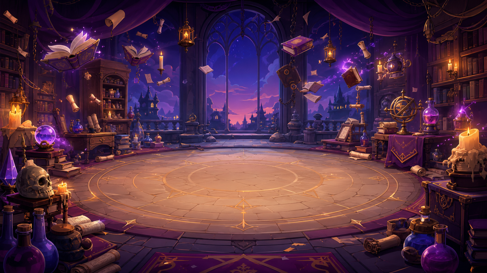

# Archmage Brolo: Card Battle



[](https://slay-the-spire-esc-game.vercel.app)
[](#tech-stack)
[](#project-status)

**Archmage Brolo: Card Battle** is a comedic, hand-built wizard card battler inspired by the tactile joy of deckbuilding roguelikes. You play as Archmage Brolo, an overconfident spellcaster with questionable methods, against Skelly Steve, a surprisingly expressive skeleton who is doing his best.

The project is deployed as a static browser game and focuses on polished card feel: cards fan from the bottom of the screen, lift on hover, drag smoothly, target enemies with animated feedback, and return or discard through interpolation instead of snapping.

## Live Demo

Play it here:

**https://slay-the-spire-esc-game.vercel.app**

## Highlights

- Title screen, replay flow, and result screen
- Smooth physical card interactions with hover lift, drag follow, and animated discard movement
- Targeted attacks with a magical aiming line and spell projectile effects
- Defensive, healing, and attack cards with readable fantasy UI
- Animated combat feedback, floating text, sparkles, trails, and impact bursts
- Fully static deployment with no framework, bundler, or runtime dependency
- Responsive layout for desktop and mobile-sized screens

## Tech Stack

- **HTML** for the static game shell
- **CSS** for responsive fantasy UI, title/result screens, card presentation, and combat layout
- **Vanilla JavaScript** for game state, turn flow, card physics, input handling, deck management, and effects
- **Canvas** for targeting lines, particles, projectiles, and magical combat effects
- **Vercel** for hosting

## Gameplay Loop

1. Click **Play** on the title screen.
2. Draw a hand of spells.
3. Drag attack cards onto Skelly Steve or drag skill cards into the play area.
4. Manage energy, block, healing, and damage.
5. End your turn and survive Skelly Steve's response.
6. Win or lose the fight, then choose **Play Again** or **Back to Title**.

## Project Structure

```text
.
|-- Assets/              # Local generated game artwork
|-- css/
|   |-- style.css        # Combat, cards, layout, effects, responsive battle UI
|   `-- screens.css      # Title and result screens
|-- js/
|   |-- AppController.js # Title/play/result app state
|   |-- GameManager.js   # Round lifecycle, turn flow, card effects, UI updates
|   |-- Card.js          # Card DOM, hover/drag/play state, interpolation
|   |-- InputManager.js  # Pointer input and drag release routing
|   |-- AnimationManager.js
|   |-- Character.js
|   |-- Enemy.js
|   |-- Deck.js
|   |-- utils.js
|   `-- main.js
|-- index.html
`-- ARCHITECTURE.md
```

## Run Locally

Because the game is static, you can open `index.html` directly in a browser.

For a local server:

```bash
python3 -m http.server 5175
```

Then visit:

```text
http://localhost:5175
```

## Project Status

This is a playable prototype built around the core interaction feel. The current architecture intentionally keeps the game static and dependency-free while leaving room for future systems such as a larger card catalog, debug menu, feature flags, deterministic benchmarks, and a unit test harness.

## Portfolio Notes

This project demonstrates:

- Building a complete interactive browser game without a framework
- Designing tactile UI motion with interpolation and pointer input
- Keeping canvas effects bounded and frame-friendly
- Structuring a growing vanilla JavaScript codebase with documented architecture
- Shipping a static game to production on Vercel

## Repository

GitHub:

**https://github.com/Kiril-P/slay-the-spire-esc-game**
