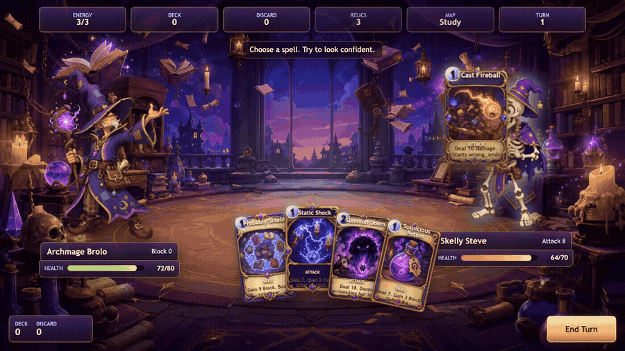
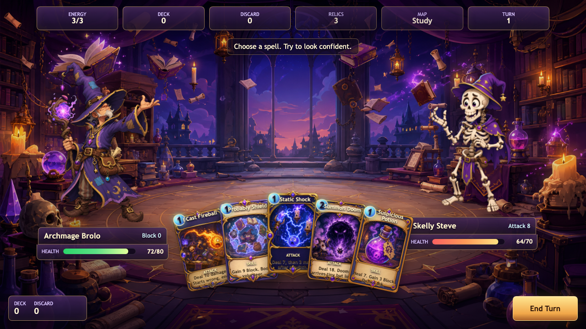
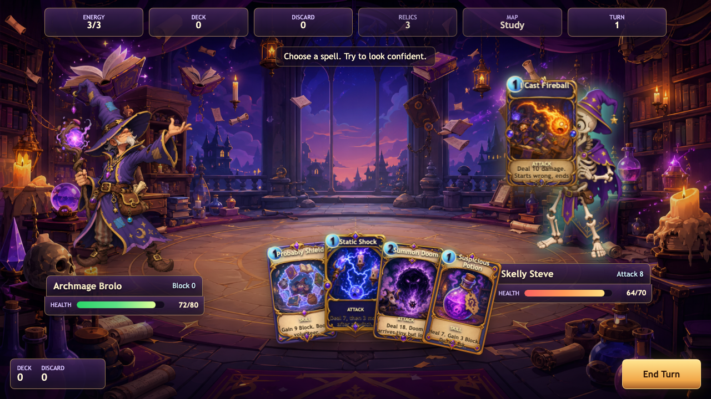

# Archmage Brolo: Card Battle



Drag questionable spells into battle and make Skelly Steve regret meeting Archmage Brolo.

**[▶ Play in browser](https://kpetrovski.me/play/archmage-brolo-card-battle/)**





## How to play

1. Click **Play** and choose a card from your hand.
2. Drag attack cards onto Skelly Steve; drag skill cards into the play area.
3. Spend energy on attacks, block, or healing, then click **End Turn**.
4. Survive Steve’s response and defeat him before he defeats you.

A single-battle prototype focused on physical card movement, magical targeting, and combat feedback.

## Development

HTML, CSS, vanilla JavaScript, Canvas; no build step.

Open `index.html` directly, or serve this directory:

```sh
python3 -m http.server 5175
```

[Development, verification, and deployment notes](DEVELOPMENT.md).
